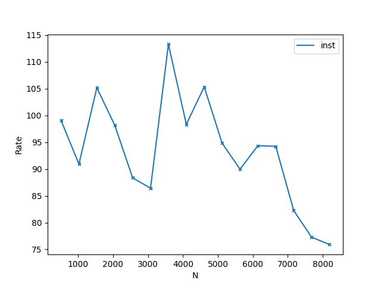

<center><h1>Project3:Matrix Multiplication</h1></center>

**Name**: 周益贤(Zhou Yixian)

**SID**: 12211825

## Part1 项目分析

本次项目旨在实现尽可能高效的矩阵乘法，并测试对于 $2^4$ 至 $2^{16}$ 大小方阵的运算效率，并与 OpenBLAS 进行对比。

主流的矩阵乘法算法有复杂度为 $O(n^3)$ 的朴素算法和 $O(n^{2.81})$ 的 Strassen 算法。虽然目前矩阵乘法已有复杂度约为 $n^{2.371}$​​ 的算法，但此类算法通常难以付诸实践。因此本次将分别优化朴素算法和 Strassen 算法，试图接近 OpenBLAS 的速度。

#### 1. 项目结构

```
Project3
├-- CMakeLists.txt
├-- inc
|	├--matrix.h
|	└─-kernel.h
|
└─- src
	├--naive_mm.c
	├--matrix.c
	├--strassen_mm.c
	├--cuda_mm.cu
	└─-benchmark.c

```

1. matrix.h / matrix.c

   这些文件中包含矩阵和基本函数的定义和实现。

   ```c
   struct matrix{
       size_t cols;
       size_t rows;
       value_ptr data;
   
       int init_flag;
   };
   typedef struct matrix mat_t[1];
   typedef struct matrix *mat_ptr;
   ```

   使用行主序的一维数组模拟二维数组，即 `A(i, j) = A[i * rows + j]`.

   `init_flag` 用于识别矩阵的 `data` 指针是否已经初始化，在初始化时其被赋予一个常数 `INIT_FLAG` .

   可以使用 `mat_init` 初始化一个已定义的矩阵，或使用 `mat_create` 直接获取一个已经分配空间并初始化的指针。两种方式中 `data` 指针均按照 $64\cdot k$ 对齐，$k$​ 的取值取决于指令集最大字长。 

   所有函数都会拒绝 `init_flag` 不等于 `INIT_FLAG` 的对象，以确保 `data` 字段是可用的，对象销毁时该字段被重置。

2. kernel.h

   该文件根据系统和编译选项，定义了指令集和空间分配函数的别名。

   同时也定义了不同矩阵乘法需要的底层函数。

3. *_mm.c/cu

   这些文件实现了与名称对应的矩阵乘法，以及与之相关的底层函数。

4. benchmark.c

   该文件为测试代码的示例。

5. CMakeList.txt

   调整该文件中 OpenBLAS 的目录设置后，可用 cmake 构建该项目。
   
   由于不能上交压缩包，提交文件中没有区分目录，cmake 已做对应改动，不需要重新放置到相应目录。

#### 2. 测试平台

主要使用 CPP 课程服务器（机器1）和笔者的笔记本（机器2）进行测试。

服务器 （主要用于测试 AVX512 和 CUDA）：

+ 处理器：Intel Xeon Gold 6240 (24 核) x2

  基准频率：2.6 GHz

  最大频率：3.9 GHz

  缓存大小：L1D 单核 32K，L2 单核 1MB，L3 共享 24.75 MB.

+ 内存：128 GB

+ 操作系统：Linux 5.15.0-102-generic

笔记本（主要用于测试 AVX256 以及常规项目）：

+ 处理器：Intel 12700H (6 P核 + 8 E核)

  基准频率：2.3 GHz

  最大频率：P 核 4.7 GHz，E 核 3.5 GHz

  缓存大小：L1D P核 48KB, L2 P核 1.25MB, L3 共享 24.0MB.

  实测小核表现很幽默，所以省略部分小核数据

+ 内存：16 GB.

+ 操作系统：Windows11 23H2.

#### 3. 测试指标

主要使用四个指标：用时 $T$，对数时间 $\log T$，每秒十亿次浮点运算次数 $\text{GFLOPS}$，OpenBLAS 用时比例 $R$​.

这些指标在上一次项目中已经解释过，此处不再赘述。

特殊地，计算 GFLOPS 时，始终认为运算一个 $N\times N$ 方阵乘法的浮点运算次数为 $2N^3$，尽管 Strassen 的计算方法不同。

#### 4. 测试方法

使用 `rand` 函数生成 `[-1,1]` 间均匀分布的矩阵作为测试用例，以 OpenBLAS 结果为标准答案，最大绝对误差小于 $10^{-3}$ 视为结果正确（对 CUDA 适当放宽限制，能起到检验正确性的效果即可）。

分别准备了 $N = 2^{4}, 2^{5}, ..., 2^{15}, 2^{16}$ 共 $13$​ 组测试，每组测试重复四次，取后三次平均值为实际用时。

为了获得完整的图表，会补充部分测试使得数据点更平滑。

于老师有言：

>如果Project3程序运行10秒还没结果，就没有必要继续了。没必要分析那么大的计算量

因此服务器上测试以 $10$ s 为限制，未能得出结果视作超时，本地测试则适当放宽时限，不超过$20$ s.

这样也最大限度避免了本地测试的发热问题。

计时方法：Windows 下使用 `clock_gettime` 获取纳秒级时间，Linux 下使用 `gettimeofday` 获取微秒级时间，均折算至毫秒。

```c
#ifdef __linux__

#include<sys/time.h>
double get_clock(){
    struct timeval t;
    gettimeofday(&t, NULL);
    return t.tv_sec * 1e3 + t.tv_usec / 1e3;
}

#else

#include<time.h>
double get_clock(){
    struct timespec tim;
    clock_gettime(CLOCK_MONOTONIC, &tim);
    return tim.tv_sec * 1e3 + tim.tv_nsec / 1e6;
}

#endif
```

## Part2. 测试及分析

编译均开启最大支持的指令集、OpenMP，以及 `-O3` 选项。

由于部分优化的特殊性，不是所有函数都支持任意大小的矩阵乘法，如 Strassen 仅支持 $2^n$ 大小的矩阵。

### 1. 普通乘法

对应文件 `naive_mm.c` 

#### 1.1 一般实现

普通矩阵乘法使用三重 for 循环直接计算：

```c
//mat_mul_plain
for(size_t i = 0; i < M; ++i)
    for(size_t j = 0; j < N; ++j){
        value_type val = 0;
        for(size_t k = 0; k < K; ++k)
            val += a(i, k) * b(k, j);
        res(i, j) = val;
    }
```

**分析**

需要进行 $N^3$ 次乘法，$N^3$ 次加法，$N^3$ 次读入 `a` 数组和 `b` 数组，$N^2$ 次写入 `res` 数组。

总计 $2N^3$ 乘加运算，$2N^3 + N^2$​​​​ 次读写操作，其中 `b` 数组的读取位置不连续。

**结果（机器2）**


$N=1024$ 时耗时异常突变的问题在上一次项目中已经分析过，此处不作考虑。

可以观察到效率基本维持在 $3$ GFLOPS 附近，与 CPU 频率接近。

**瓶颈**

访存与运算操作数量相近，单核下 CPU 理论运算效率为 $2.3-4.7$ GFLOPS，低于内存带宽。且矩阵较小，可以大部分存入缓存，故主要为 CPU 运算瓶颈。

#### 1.2 转置乘法

要提高 CPU 运算效率，可以使用多核或者 SIMD 指令集，我们暂时不考虑多核的问题。

朴素乘法中 `b` 矩阵按列访问元素，这意味着我们每次都要跨过一整行，这不仅阻止了我们使用 SIMD，还浪费了通过 Cache Line 加载进缓存的相邻元素。对于运算和访存都是不优的。

因此我们考虑改善这一状况。

一种解决方案是转置 `b` 矩阵，使得原本的”行乘以列“变成”行与行点乘“。

```c
//mat_mul_trans
for(size_t i = 0; i < M; ++i)
    for(size_t j = 0; j < N; ++j){
        value_type val = 0;
        #pragma omp simd reduction(+: val)
        for(size_t k = 0; k < K; ++k)
            val += a(i, k) * b_trans(j, k);
        res(i, j) = val;
    }
```

**分析**

运算次数和访存次数均无改进，但是所有访存操作均连续，可以进一步降低访存耗时。

同时由于使用上了 SIMD，机器的理论算力提高了 $8$ 倍（对 AVX2）。

**结果（机器2）**


可以观察到仅转置的运算效率大约在 $4-5$​ GFLOPS，比之前略有提升，证明访存有一定优化，但并非瓶颈。

而加入了 SIMD 的转置优化效率达到 $16$ GFLOPS，有 $4$​ 倍左右的提升，但是会随着矩阵增大逐渐降低。

注意到实际提升比理论提升差了不少，可能是因为点乘运算本身不是很适合 SIMD，累加答案的过程比较繁琐。

瓶颈看起来基本上仍在CPU，有没有更好的方案？

#### 1.3 交换循环顺序

对于 1.2 中的问题，我们还有一种不需要转置的解决方案：交换内部两层循环的顺序，也能在优化访存的同时用上 SIMD:

```c
//mat_mul_reorder
for(size_t i = 0; i < M; ++i)
    for(size_t k = 0; k < K; ++k)
        for(size_t j = 0; j < N; ++j)
            res(i, j) += a(i, k) * b(k, j);
```

**分析**

此时访存操作变为 $N^3$ 次读入 `b`，$N^2$ 次读入 `a`，$N^3$ 次写入 `c`.

理论上区别不大。

而计算由点乘变为逐项相乘、逐项累加，更加适合SIMD.

**结果（机器2）**

用时对数：


算力：


可以看到矩阵大小在 $2048$ 以下时，算力在 $30-40$​​ GFLOPS，对比仅转置的情况，达到了理论的八倍提升。

在 2k 至 3k 大小，运算效率迅速下滑并最终稳定至 $12$​ GFLOPS 左右，接近转置+SIMD优化的结果。

显然该方案 CPU 运算效率和空间需求都要优于转置的方案。

**瓶颈**

2k - 3k 间有明显的效率下滑，证明此时 CPU 瓶颈逐渐向内存瓶颈转变。

#### 1.4 并行加速

并行既可以成倍地提升 CPU 运算效率，更密集的访存也可以等效于增大了内存带宽，一举两得。

使用 OpenMP 一键并行：

```c
//mat_mul_reorder
#pragma omp parallel for
for(size_t i = 0; i < M; ++i)
    for(size_t k = 0; k < K; ++k)
        for(size_t j = 0; j < N; ++j)
            res(i, j) += a(i, k) * b(k, j);
```

**结果（机器2）**

用时对数：


算力：


可以观察到对于小矩阵由于开启线程的额外开销，并行反而慢了不少。

而对于 256 - 2k 的矩阵，并行后算力从 $30$ GFLOPS 提升到 $200$ GFLOPS，提升六倍左右。

对于大于 2k 的矩阵，算力从 $12$ GFLOPS 提升到 $80$ GFLOPS，提升亦是六倍左右。

~~考虑到本机恰好有六个大核，足以证明小核没一点用~~

**瓶颈**

事实上并行平等地提高了 CPU 和内存的效率，2k 后的内存瓶颈只是提高了，并没有得到解决。

#### 1.5 分块乘法

内存带宽本身是难以提高的。因此想解决内存瓶颈，还需要降低访存次数。

考虑将原矩阵分为 $L\times L$ 的小块，每次取出两个小块做乘法，并将结果累加回去。这样每个小块都可以存入缓存，获得更高的访存速度。此时内存访存只发生在读取和写入整块的时候，每个块被访问 $\dfrac N L$ 次，一次访问 $L^2$ 个元素，共 $\dfrac {N^2} {L^2}$ 个块，且其中一个块可以暂存，不用每次读取，总访存次数变为 $\dfrac {2N^3}{L} + N^2$ 次。

在缓存大小允许的情况下扩大 $L$​ ，即可最大限度减少访存次数。

对应 `mat_ptr mat_mul_block` 函数：

```c
float A[BS][BS];
float B[BS][BS];
float C[BS][BS];

for(int bi = 0; bi < N; bi +=BS){
    for(int bk = 0; bk < M; bk += BS){
        //copy block to A
        for(int bj = 0; bj < K; bj += BS){
            //reset C and copy block to B
            for(int i = 0; i < BS; ++i)
                for(int k = 0; k < BS; ++k){
                   #pragma omp simd
                    for(int j = 0; j < BS; ++j){
                        C[i][j] += A[i][k] * B[k][j];
                    }
                }
			//store C to res
        }
    }
}
```

**结果（机器2，块长64）**

用时对数：


算力：


对小矩阵由于多了分块的开销，效率进一步降低。

对于1k-2k 的矩阵，分块的开销占比逐渐降低，效率与不分块相近。

对于大于 3k 的矩阵，未出现内存瓶颈，效率反而升高至 $300$ GFLOPS，效果显著。

#### 1.6 对齐优化

指令集对对齐的内存有额外优化，因此将分块矩阵进行对齐：

```c
alignas(_MALLOC_ALIGN) value_type A[BS][BS];
alignas(_MALLOC_ALIGN) value_type B[BS][BS];
alignas(_MALLOC_ALIGN) value_type C[BS][BS];
```

**结果（机器2，块长64）**

用时：


算力：


算力提升至 $350$ GFLOPS，大约提升 $25\%$.

效率看起来已经不错了？是不是可以和 OpenBLAS 比一比了？


好吧，看起来只达到了 $50-70\%$.

还要继续努力。

#### 1.7 循环展开

现在我们的乘法主要分为两部分：分块和小矩阵乘法（kernel）。

更快的 kernel 意味着更高的效率，我们试图优化这一部分：

对外层循环进行展开，加载 A 矩阵 2x4 的一个块至寄存器，乘以 B 矩阵的 4xN 的一个块，得到 2xN 的 C 矩阵。

kernel 部分对应 `mat_mul_store_2x4xN` 函数：

```c
for(int i = 0; i < BS; i += 2){             
    for(int k = 0; k < BS; k += 4){
        //8次载入A
        value_type v01 = A[i][k], v02 = A[i][k + 1], 
                    v03 = A[i][k + 2], v04 = A[i][k + 3];
        value_type v11 = A[i + 1][k], v12 = A[i + 1][k + 1],
                    v13 = A[i + 1][k + 2], v14 = A[i + 1][k + 3];
        #pragma omp simd
        for(int j = 0; j < BS; ++j){
            value_type t1 = 0 , t2 = 0;
			//4次载入B，8次FMA
            t1 += v01 * B[k][j];
            t2 += v11 * B[k][j];

            t1 += v02 * B[k + 1][j];
            t2 += v12 * B[k + 1][j];

            t1 += v03 * B[k + 2][j];
            t2 += v13 * B[k + 2][j];

            t1 += v04 * B[k + 3][j];
            t2 += v14 * B[k + 3][j];
			//2次载入C，2次写入C，1次 ADD
            C[i][j] += t1;
            C[i + 1][j] += t2;
        }
    }
}
```

**分析**

首先，循环展开可以减少循环次数，优化比较跳转的开销，不过这方面优化比较有限。

其次，原本 A 矩阵一个元素载入寄存器后，只与 B 矩阵 1x8 的元素运算，而现在变成了 4x8 个。载入寄存器的操作次数减少了，进一步减少访存开销。

记 $K_{\text{avx}}$ 为一个指令集寄存器能容纳的 float 数目，$L=\dfrac N {K_\text{avx}}$.

对于一个 2x4xN 的乘法，需要访存 $8+8L$ 次，运算 $9L$ 次，比例 $\dfrac 8 {9L} + \dfrac 8 9$​. 

对比普通 SIMD (1.5 部分的 kernel)：

```c
//预载1次A
#pragma omp simd
for(int j = 0; j < BS; ++j){
    //载入1次B和C，进行一次FMA
    C[i][j] += A[i][k] * B[k][j];
}
```

需要访存 $1+2L$ 次，运算 $L$ 次，比例 $2 + \dfrac 1 L$，访存次数多了一倍多。

**结果（机器2，块长64）**


提升接近 $50\%$，大部分时候能达到 OpenBLAS 的 $80\%-90\%$.

#### 1.8 指令集特化优化

回想循环展开的一个作用：增加寄存器复用，减少访存次数。

那么，展开到什么程度才算合适呢？能不能把所有的元素全部放进寄存器里呢？

显然不行。注意到 AVX2 有 16 个 ymm 寄存器，如果我们超出了这些寄存器，就势必要把一部分内容放回内存，无法达到目的。

按照 1.7 中的展开办法，A 矩阵占用 8 个寄存器，B 矩阵占用 4 个，C 矩阵占用 2 个，共计 14 个，没有完全利用。

因此考虑改进展开方法：记单个寄存器可容纳 $S$ 个 float.

每次取出 A 矩阵 3xN 的一条，乘以 B 矩阵 NxK 的一条，得到 C 矩阵 3xK 的一块，其中 $K = 4S$.

这样 A 矩阵使用 3 个寄存器，B 矩阵 1 个，C 矩阵 12 个，恰好用完 16 个 ymm 寄存器。

 kernel 部分对于 `kernel_matmul_3xNx32` 函数。

```c
 for(int si = 0; si < KN_BS; si += 3){
    for(int sj = 0; sj < N; sj += KSIZ){
        c00, ..., c23 = MM_ZERO();
        for(int k = 0; k < N; ++k){
            //载入3次A
            a0 = MM_SETALL(A(si, k));
            a1 = MM_SETALL(A(si + 1, k));
            a2 = MM_SETALL(A(si + 2, k));
			
            //(载入1次B，进行3次FMA)*4
            bv = MM_LOAD(&B(k, sj)));
            c00 = MM_FMADD(a0, bv, c00);
            c10 = MM_FMADD(a1, bv, c10);
            c20 = MM_FMADD(a2, bv, c20);

            //...*3
        }
        //写入12次C
        //store
    }
}
```

**分析**

对于一条 3xNx32 的乘法，需访问内存 $7N + 12$ 次，进行运算 $12N$ 次，比例 $\dfrac 7 {12} + \dfrac 1 N$。对比 1.7 中循环展开的 $\dfrac 8 9$，又有 $50\%$ 的提升。

**结果（机器2，块长64-256）**




相比普通循环展开提升 $6\%-10\%$.

对中等大小矩阵，算力达到了 $500-600$ GFLOPS，达到OpenBLAS的 $90\%-110\%$，互有胜负。

对较大的矩阵效率略有所下降，大约是 OpenBLAS 的 $80\%-90\%$.

再大的矩阵本地已经不方便测量了，不妨到服务器上看看。

**结果（机器1，块长64-256）**


小矩阵效率还不错。可大矩阵好像有有点拉跨，只有 $60-80\%$ 的性能，怎么回事呢？

#### 1.9 AVX512特化

再三确认我们确实用上了 AVX512，难道它和 AVX2 不止字长有区别？

还真是！

AVX512 竟然有 32 个 zmm 寄存器，我们按照相同的展开方法，只使用了一半的寄存器，效率当然低下。

于是我们加宽分块宽度，改为 6xNx64 分块（参考`kernel_matmul_6xNx32`）函数。

**结果（机器1，块长64-256）**


效果显著，提升超过 $50\%$！

现在中等大小矩阵效率数倍于 OpenBLAS，大矩阵效率基本在 $100-110\%$ 左右，可以认为是完全追上了 OpenBLAS.

分块参数以及分块方式方面或许还能再优化，不过试参数没什么意思，就到此为止吧。

#### 1.10 总结

观摩 OpenBLAS 的代码，发现它其实做的事情跟我们差不多：分块，kernel 乘法。

但是它有针对每个平台的不同参数，更加优秀的分块方式，以及每个架构一套汇编 kernel 乘法。它不快谁快呢？

越是努力追赶越是发现 OpenBLAS 的厉害，它并不是厉害在领先多少，而是在每个平台上都能领先，这是非常恐怖的事情。反观我的代码，换一个平台就需要重新追赶一次，虽然不知道到底是哪里的问题，但是换个机器效率就又不一样了。OpenBLAS 这一份通用性，才是最重要的。

------

不过我们的路还没有结束，假如在复杂度上更进一步，效率能否继续提高？

### 2. Strassen 算法

这部分对应 `strassen_mm.c` 文件。

Strassen 算法的流程大致如下，总体思路是将四个子矩阵的八次乘法优化到七次，以达到 $O(n^{\log_27})$ 的理论复杂度，而代价则是十八次次额外的加减法。

首先构造 $10$ 个辅助矩阵：
$$
\begin{align}
S_ {1} &= B_{12} - B_{22}\\
S_ {2} &= A_{11} + A_{12}\\ 
S_ {3} &= A_{21} + A_{22} \\
S_ {4} &= B_{21} - B_{11}\\ 
S_ {5} &= A_{11} + A_{22} \\
S_ {6} &= B_{11} + B_{22} \\
S_ {7} &= A_{12} - A_{22}\\ 
S_ {8} &= B_{21} + B_{22}\\ 
S_ {9} &= A_{11} - A_{21}\\
S_{10} &= B_{11} + B_{12}
\end{align}
$$
递归计算七次矩阵乘法：
$$
\begin{align}
P_{1} &= A_{11}\cdot S_1\\
P_{2} &= S_2 \cdot B_{22}\\
P_{3} &= S_3 \cdot B_{11}\\
P_{4} &= A_{22} \cdot S_2\\
P_{5} &= S_{5}\cdot S_{6}\\
P_{6} &= S_{7}\cdot S_{8}\\
P_{7} &= S_{9}\cdot S_{10}\\
\end{align}
$$
计算结果：
$$
\begin{align}
C_{11} &= P_{5} + P_{4} - P_{2} + P_{6}\\
C_{12} &= P_{1} + P_{2}\\
C_{21} &= P_{3} + P_{4}\\
C_{22} &= P_{5} + P_{1} - P_{3} - P_{7}\\
\end{align}
$$


~~这玩意是怎么看出来的~~

虽然多了这么十八次加减法，但是乘法少了一次，所以这个东西，也许，大概，对足够大的矩阵，会快一点点。。？（心虚）

考虑到 Strassen 的特殊性，仅测试 8k 以上的矩阵。

#### 2.1 一般实现

我们可以根据首地址和每行总元素数直接获取一个矩阵的子矩阵，而不需要拷贝，否则巨大的拷贝开销会使得算法完全没法用。

虽然矩阵看起来众多，但是可以每次仅计算一个 $P$ 矩阵 ，算出后直接累加到 $C$ 中。这样，Strassen 实际只需要三个中间矩阵以存放临时变量。

中间代码过长就不作展示了，可以参考 `kernel_strassen` 函数。

经实验，在 $N=4096$ 或 $8192$ 处返回是比较合适的。因此 Strassen 实际上只能做几层，也就不必要求矩阵大小是 $2^n$​ 了。

**结果（机器1，N<=4096 返回）**


效率很差，完全不敌普通乘法，这也是可以想见的，毕竟频繁的空间申请释放加上大规模的加减法，访存开销变得巨大无比。

#### 2.2 空间分配优化

由于每一步只需要三个中间矩阵，我们可以在最外层申请一个 $N\times N$ 的缓冲区，每层使用三个 $\dfrac 1 2N\times \dfrac 1 2 N$​ 的子矩阵，最后一个用作下一层的缓冲区。即：

```c
const size_t H = N / 2;
value_ptr mat0 	  = buf;
value_ptr mat1 	  = mat0 + H * H;
value_ptr mat2 	  = mat1 + H * H;
value_ptr nxt_buf = mat2 + H * H;
//...
```

这样刚好用尽缓冲区，可以避免频繁的内存分配和释放。

同时调整返回参数，根据范围不同选择合适的底层乘法函数。

**结果（机器1，8192 返回）**


即使这样，Strassen 效率依然可怜，只是堪堪追上 OpenBLAS，在部分点能有所超越。

如果只测试 $2^k$ 的数据，那么 Strassen 其实表现还不错，问题出在中间这部分。

注意到 8k-9k 的骤降和 9k-16k 的缓慢爬升：这是因为 9k 开启了新一层的分块，底层乘法的大小从 4k 逐渐增大至 8k。而底层乘法的效率在 4-8k 阶段是逐渐增大的，在 4k 大小其实并不理想。因而 Strassen 的效率也随之骤降，并缓慢增长，在16k 时达到最大，越过 16k 时又会骤降。

因为这样的阶梯式增长，Strassen 难以发挥出理论上低复杂度的优势。 

只做一层到两层可以避免这样的阶梯增长，但相应的，此时它的效率提升效果又不明显，属于是效率和稳定性难以两全。

#### 2.3 总结

事实上有更好的实现仅需十五次加减法，但是相应地，需要更多的缓存（6个临时矩阵），经测试少三次加减法对效率几乎不构成影响。

由于访存效率问题，加减法比起乘法没有理论上的大优势，因此 Strassen 仅对极大矩阵有微弱提升。

又考虑到 Strassen 效率对矩阵大小比较敏感，很不稳定，且递归次数越多精度越低，实际上难以使用。

或许对于更大的矩阵，Strassen 能发挥出更多作用，但是它已经没有机会证明自己了，毕竟它用时已经太长了，不适合在服务器上一直占用。

------

似乎在运算效率和复杂度方面都已经很难提升了。

然而，我们的任务还有高达 64k 的矩阵乘法。即使我们使已经几乎超越了 OpenBLAS，在 10s 内也仅能计算出最多 20k 的矩阵乘法。如果想让程序算出 64k 的乘法，需要再提高 26 倍的效率，这已经远远超出理论算力上限了。

所以这是个不可能完成的任务。

对......对吗？

注意到这台服务器竟然有足足四张 2080Ti 显卡，不拿来挖矿可惜了，所以眼前的路已经很明确了:

*cuda!*

### 3. CUDA 加速

该部分对应 `cuda_mm.cu` 文件。

#### 3.1 CUDA 试水

对应 `mat_mul_cuda_plain` 函数。

CUDA 编程思路比较奇妙，因为每一个线程都运行相同的逻辑，所以我们需要编写单个线程的运行逻辑（kernel），然后为这个函数分配线程块（block）和线程格（grid）的参数。

对于朴素的矩阵乘法，可以写出这样的 kernel:

```c
__global__ void kernel_cuda_mul_plain(...){
    size_t x = threadIdx.y + blockDim.x * blockIdx.x;
    size_t y = threadIdx.x + blockDim.y * blockIdx.y;

    if(x < M && y < N){
        value_type val = 0;
        for(int i = 0; i < K; i++)
            val += a[x * K + i] * b[i * N + y];
        res[x * N + y] = val;
    }
}
```

先不管 x 和 y 看起来有什么地方不对，我们在最后再来讨论这个问题。

首先根据线程和线程块的编号，计算出当前线程要求的坐标，然后使用朴素矩阵乘法进行计算。

配置好并行参数，就可以对每个块使用 SIZxSIZ 线程并行运算。

```c
dim3 block((M + SIZ - 1) / SIZ, (N + SIZ - 1) / SIZ);
dim3 threads(SIZ, SIZ);
kernel_cuda_mul_plain<<<block, grid>>>(...)
```

考虑到单个块最多 $1024$ 线程，这里取  $SIZ = 32$.

**结果（机器1）**


取得了将近 $1000$ GFLOPS 的好成绩。

怎么还没CPU快，2080Ti 就这？

好吧，本来也没指望朴素算法能跑多快。毕竟这样做乘法是实打实的访问全局内存，需要上百个周期，显卡有力也使不出来。

#### 3.2 共享内存优化

共享内存是一个块中线程共用的内存，具有更低的访问延迟，不过大小有限。

因此我们继续考虑分块，将一个块载入共享内存后计算。

对应 `mat_mul_cuda_shared` 函数。

```c
const size_t shared_len = 128, SIZ = 32;
__shared__ value_type shared_a[SIZ][shared_len];
__shared__ value_type shared_b[SIZ][shared_len];
//calculate x, y.

value_type val = 0;
for(bk = 0; bk < K; bk += shared_len){
    __syncthreads();
    //load shared_a, shared_b
    __syncthreads();
    //val += a[x][k] * b[k][y]
}
if(x < M && y < N){
    res[x * N + y] = val;
}
```

**结果（机器1）**


提升大约 $30\%-50\%$，效果还行。

不过也还没我们的 CPU 算法快，显卡的性能依然没有发挥出来。

虽然共享内存具有更低的时延，但是这个 ”更低“ 依然有 20-30 个周期，相比于计算效率仍然不够看。

#### 3.3 寄存器优化

能不能比共享内存更快？

当然可以。寄存器时延肯定低，不过数量也更少就是了。

因此我们考虑每个线程计算一个 4x4 的块而非单点，这样我们可以二次分块，每次用寄存器保存 4x1 的 A 矩阵和 1x4 的 B 矩阵，乘完放回 4x4 的 C 矩阵，可以进一步减少共享内存的访问。

对应 `mat_mul_cuda_reg` 函数。

```c
const size_t shared_len = 32, SIZ = 32, BS = 4;
__shared__ value_type shared_a[shared_len][SIZ * BS];
__shared__ value_type shared_b[shared_len][SIZ * BS];
//calculate x, y

value_type res_buf[BS][BS] = {{0}};
value_type a_buf[BS], b_buf[BS];
for(bk = 0; bk < K; bk += shared_len){
    //load shared_a, shared_b
    __syncthreads();
    for(size_t k = 0; k < km; ++k){
        //load a_buf, b_buf
        //res_buf += a_buf * trans(b_buf)
    }
    __syncthreads();
}
//store res_buf to res
```

**结果（机器1）**


算力飙升至 $3500$ GFLOPS，提升高达 $200\%$​​​​！只需 2s就可以跑完 16k 了！

我们试试 32k 要多久。。。欸，怎么失败了？

注意到 2080Ti 有 11GB 显存，而 3 个 32k 矩阵刚好占掉 12GB，会爆掉显存，所以我们不能无脑地把矩阵存进显存里了。

#### 3.4 全局分块

考虑到 CUDA 对于小矩阵表现非常糟糕，我们希望分的块在不爆显存的前提下尽可能大，同时也能用上四张显卡。

于是将 A 和 B 矩阵分别沿一个维度四分块得到四个长条，每次选择其中两个乘起来，共需16次。

对于 64k 的矩阵，一个条的大小为 4GB，结果大小为 1GB，共计 9GB，还是比较安全的。

对应 `mat_ptr mat_mul_cuda_multi` 函数，由于各设备实际上不需要同步或通信，可以直接由 OpenMP 管理线程。

```c
#pragma omp parallel for num_threads(DEVICE_CNT)
for(int dev_id = 0; dev_id < DEVICE_CNT; ++dev_id){
    cudaSetDevice(dev_id);
    //setup...
    cudaMemcpy(b_buf, b_tile, B_TILE_LEN * K * sizeof(value_type), cudaMemcpyHostToDevice);
    for(int row_id = 0; row_id < DEVICE_CNT; ++row_id){
        cudaMemcpy(a_buf, a_tile, A_TILE_LEN * K * sizeof(value_type), cudaMemcpyHostToDevice);
        
        kernel_cuda_mul_tile<<<block, threads>>>(...);
        
        cudaMemcpy(res_host, res_buf, RES_TILE_SIZ * sizeof(value_type), cudaMemcpyDeviceToHost);
        //store res_host to mat_res...
    }
    //clear...
}
```

**结果（机器1）**


对于中等大小矩阵，效率不增反降。观察到此时 GPU 占用率很低，可以知道此时任务量并不足以发挥单张显卡全部性能，所以这种规模下增加显卡数量对算力没有任何帮助。同时又多了分块开销以及额外的数据传输需求，导致效率下降。

从 8k 开始，多卡算力反超单卡。对于更大矩阵，多卡算力明显更高。

~~并且单卡事实上根本跑不了~~

#### 3.5 资源预取

概括之前的 kernel 乘法，基本是如下流程：

```c
for(int bk = 0; bk < K; bk += TILE_LEN){
    load_shared_memory(a, b);
    sync();
    mat_mul(res_buf, a, b);
    sync();
}
store(res_buf, res);
```

注意到加载内存和运算由两个同步隔开，同一时间二者只有一个在干活。

这好吗，这不好。

但是数据没加载完也不可能运算吧。。。

所以我们考虑使用双缓冲，运算结束后直接开始加载下一层缓冲：

```c
load_shared_memory(buffer0);
for(int bk = 0; bk < K;){
    sync();
    mat_mul(buffer0);
    //no need to sync here.
    bk += TILE_LEN;
    if(bk < K){
        load_shared_memory(buffer1);
    	swap_buffer(buffer0, buffer1);
    }	
}
store_result();
```

这样两个同步变成了一个，虽然运算和加载还是各干各的，但是运算完成不必同步，可以有效减少间隔。

**结果（机器1）**


效果有但不多。

毕竟 shared memory 大小有限，要多开一倍的 buffer，每个 buffer 的大小就要减少一半，这一定程度上又减少了效率，所以最终提升没有特别高。

最终我们取得了 32k 8s，64k 50s 的成绩。

虽然离目标还很远，但是我也没什么办法了。

#### 3.6 总结

好吧，我们最后也没能在 10s 内算完 64k，只是堪堪算完 32k 而已。

不过四张显卡理论上有 $13.45 \times 4 = 53.8$ TFLOPS 算力，而 10s 算完 64k 的矩阵乘法需要 $56$​​ TFLOPS，其实也不太够（

考虑到多卡并行的损耗，就难以实现了。

即便如此，对比我们最后的算力，这四张卡还有很大潜力没有发挥出来，但是 CUDA 写起来实在困难，也没时间做进一步优化了，有点可惜。

CUDA 的算力曲线和 CPU 的截然不同 ，CPU 在一定大小后算力会趋近于一个固定值，而 CUDA 则一路飙升，看起来根本不像 $O(n^3)$ 算法。这反映出随着矩阵大小增大， GPU 的利用率也在不断提高，所以算力会越来越高。想完全发挥出显卡的算力，并不是那么容易。

另外，都说 Strassen 误差大，CUDA 误差竟然数倍于 Strassen，甚是离谱，可能是 GPU 浮点单元实现不同导致的。

## Part 3. 总结

本次项目尝试了 SIMD、OpenMP并行、分块矩阵、循环展开等优化，最终在本地测试中达到了 OpenBLAS 的 $90\%$，在服务器上基本全面超越 OpenBLAS。

同时也尝试了不同的算法如 Strassen，以及使用 GPU 的 CUDA 加速，虽然没有完全达到预期，但是结果也还算不错。

尤其是 Strassen 这个天坑，花了不知道多少时间来写结果完全没用（

选择几个比较有代表性的算法作为最终数据：

'*' 表示数据大小不合适不作测试，'x' 表示超过一分钟无结果，'!' 为无法完成对应运算，'0' 为用时小于 0.01ms.

无标注则单位为毫秒，中括号为优化对应的章节位置。

|         优化          |  16  | 128  |  1k  |  8k   |  16k  |  32k  |  64k  |
| :-------------------: | :--: | :--: | :--: | :---: | :---: | :---: | :---: |
|    [Ref] OpenBLAS     |  0   | 0.55 | 25.5 |  766  | 5.47s | 36.1s |   x   |
|    [1.1] 朴素算法     |  0   | 2.5  | 3.3s |  24s  |   x   |   x   |   x   |
|    [1.4] 并行加速     |  0   | 1.6  | 188  | 10.2s |   x   |   x   |   x   |
|   [1.9] AVX512特化    |  *   | 0.1  | 10.3 |  655  | 4.57s | 38.1s |   x   |
|    [2.2] Strassen     |  *   |  *   |  *   |  595  | 4.67s | 35.2s |   x   |
|    [3.1] 朴素CUDA     | 0.2  | 0.5  | 7.7  | 1.24s | 6.9s  |   !   |   !   |
| [3.3] CUDA-寄存器优化 |  *   |  *   | 5.5  |  459  | 2.34s |   !   |   !   |
|  [3.5] CUDA-数据预取  |  *   |  *   | 21.9 |  363  | 1.66s | 8.12s | 51.3s |

这次也算是真正体会到了程序中的各种瓶颈，搞明白了很多影响效率的玄学问题，收获颇丰。

## Part 4. 疑难与解决

1. 随着矩阵增大，矩阵乘法的结果越来越大，而 float 绝对精度不高且随数值增大降低，容易产生高达 $10^{-3}$ 级别的误差（尤其是对于 精确度较差的 Strassen 和 CUDA），难以判断算法正确性。

   使用相对误差替代绝对误差，或使用均值为 $0$ 的分布，经实验后者比较合理，故将原本值域 $[0,1]$ 改为 $[-1,1]$​.

   尽管如此，CUDA 也时常误差超限。考虑到 CPU 和 GPU 运算结果偏差本身就比较大，只要能看出算法正确就算通过了。

2. 记得我们在 2.3.3.1 CUDA 试水的示例代码中，故意反着写了 `threadIdx.x` 和 `threadIdx.y` ，但是当时并未解释。

   这是因为一个非常抽象的现象：如果正常使用它们，效率会变得无比低下。

   ```c
   //origin(slow)
   size_t x = threadIdx.x + blockDim.x * blockIdx.x;
   size_t y = threadIdx.y + blockDim.y * blockIdx.y;
   //swap(fast)
   size_t x = threadIdx.y + blockDim.x * blockIdx.x;
   size_t y = threadIdx.x + blockDim.y * blockIdx.y;
   ```

   **结果（机器1）**

   

   正常使用 x 和 y 效率“高达” 120 GFLOPS，可以看到仅仅是交换顺序，就取得了十倍的提升，问题到底出在哪？

   出在哪？我怎么知道，这绝对是我见过最离奇的事情了，我甚至编不出一个合理的解释。

3. CUDA 编程中程序逻辑看起来没有问题，但是结果全是 0.

   大部分时候都是共享内存爆了。

   虽然理论上有 64-96KB 可用，但实际上基本不能超过 32KB，手动调整限制都没用，原因不明。

## Part 5.参考资料

[1] Goto, K., & van de Geijn, R.,A. (2008). Anatomy of high-performance matrix multiplication. *ACM Transactions on Mathematical Software,* *34*(3) doi:https://doi.org/10.1145/1356052.1356053

[2] Coder LL. (2024, March 24). *详解矩阵乘法中的Strassen算法*. 知乎专栏. https://zhuanlan.zhihu.com/p/78657463 

[3] MegEngine Bot. (2021, September 24). *CUDA 矩阵乘法终极优化指南*. 知乎专栏. https://zhuanlan.zhihu.com/p/410278370
